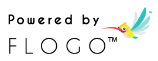

  

  <b>Project Flogo is an open source framework that makes building serverless functions and microservices easy!</b>

  
  
  
  

## Highlights

🎈 **Ultra-light process engine** 20x-50x lighter than Java or NodeRed
🏘 **Extensible & reusable** by design to build your own apps, frameworks & platforms
🎉 **100% Open Source**

Project Flogo consists of the following sub-projects available as separate repos:
* [flogo-cli](https://github.com/TIBCOSoftware/flogo-cli): A command line tool to build flogo apps 
* [flogo-lib](https://github.com/TIBCOSoftware/flogo-lib): A library to build Flogo extensions
* [flogo-services](https://github.com/TIBCOSoftware/flogo-services): Backing services required by Flogo 
* [flogo-contrib](https://github.com/TIBCOSoftware/flogo-contrib) : Flogo Extensions available out of the box

## Getting Started

Project Flogo was designed from the ground up leveraging modern technology and architectural principals to better suit the IoT, edge and microservices app developers. The current set of tooling is designed for:

- IoT Solutions developers
- Cloud-native microservices developers
- Serverless function developers
- Flogo Extensions developers 

In addition, tooling to address the needs of the zero-code application developer is available via Flogo Web UI. Project Flogo and the tooling continue to evolve quickly, we recommend that you check out the videos and sign up for updates on the project to stay current.

To get started today, refer to the [Flogo Documentation](https://tibcosoftware.github.io/flogo/) or start chatting with the team via the [project-flogo/Lobby Gitter Channel](https://gitter.im/project-flogo/Lobby?utm_source=share-link&utm_medium=link&utm_campaign=share-link).

### Extensions & IoT Solution Developer

If you are an Extensions or IoT Solutions developer, read on because it's easy to get started with Project Flogo:
* To install just the Flogo CLI and runtime, go to https://github.com/TIBCOSoftware/flogo-cli & follow instructions in the README
* For extensions developers, visit the docs in this repository to get started with developing your first Flogo activity

### Zero-code Function & Microservice Developer

If your background is in or you prefer to develop using zero-coding environments and platforms and would like to begin developing apps with Project Flogo, then read on, because we’ve been working on something special for you.

Flogo Web UI was launched under a beta license and is available via [Docker Hub](https://hub.docker.com/r/flogo/flogo-docker) or [Flogo.io](http://flogo.io). The Docker image contains the Flogo Web UI along with all required components to begin developing, testing and building deployable artifacts that leverage the Project Flogo Open Source Framework technology.

To report any issues with Flogo Web UI, use the Issue tracker on this project.

## Contributing
Want to contribute to Project Flogo? We've made it easy, all you need to do is fork the repository you intend to contribute to, make your changes and create a Pull Request! Once the pull request has been created, you'll be prompted to sign the CLA (Contributor License Agreement) online.

Not sure where to start? No problem, here are a few suggestions:

* [flogo-contrib](https://github.com/TIBCOSoftware/flogo-contrib): This repository contains all of the contributions, such as activities, triggers, etc. Perhaps there is something missing? Create a new activity or trigger or fix a bug in an existing activity or trigger.
* Browse all of the Project Flogo repositories and look for issues tagged 'kind/help-wanted' or 'good first issue'

If you have any questions, feel free to post an issue and tag it as a question, email flogo-oss@tibco.com or chat with the team and community:

* The [project-flogo/Lobby](https://gitter.im/project-flogo/Lobby?utm_source=share-link&utm_medium=link&utm_campaign=share-link) Gitter channel should be used for general discussions, start here for all things Flogo!
* The [project-flogo/developers](https://gitter.im/project-flogo/developers?utm_source=share-link&utm_medium=link&utm_campaign=share-link) Gitter channel should be used for developer/contributor focused conversations. 

For additional details, refer to the [Contribution Guidelines](https://github.com/TIBCOSoftware/flogo/blob/master/CONTRIBUTING.md).

## License 
The top level flogo repo, consisting of flow samples & documentation, is licensed licensed under a BSD-style license. Refer to [LICENSE](https://github.com/TIBCOSoftware/flogo/blob/master/LICENSE) for license text.

Flogo source code in [flogo-cli](https://github.com/TIBCOSoftware/flogo-cli), [flogo-lib](https://github.com/TIBCOSoftware/flogo-lib), [flogo-contrib](https://github.com/TIBCOSoftware/flogo-contrib) & [flogo-services](https://github.com/TIBCOSoftware/flogo-services) repos are licensed under a BSD-style license. Refer to [flogo-cli license](https://github.com/TIBCOSoftware/flogo-cli/blob/master/TIBCO%20LICENSE.txt) for license text. 

### Usage Guidelines

We’re excited that you’re using Project Flogo to power your project(s). Please adhere to the [usage guidelines](http://flogo.io/brand-guidelines) when referencing the use of Project Flogo within your project(s) and don't forget to let others know you're using Project Flogo by proudly displaying one of the following badges or the Flynn logo, found in the [branding](branding) folder of this project.

