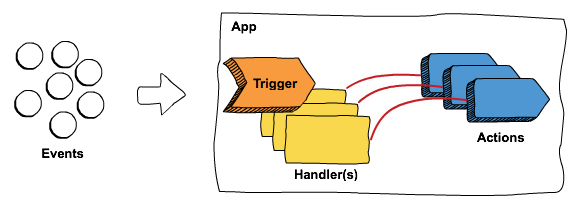

<p align="center">
  
</p>

<p align="center" >
  <b>Project Flogo is an Open Source ecosystem for event-driven apps</b>
</p>

<p align="center">
  
  
  
  <a href="https://gitter.im/project-flogo/Lobby?utm_source=share-link&utm_medium=link&utm_campaign=share-link"></a>
</p>

<p align="center">
  <a href="#project-flogo-ecosystem">Ecosystem</a> | <a href="#flogo-core">Core</a> | <a href="#flogo-flows">Flows</a> | <a href="#flogo-streams">Streams</a> | <a href="#flogo-rules">Flogo Rules</a> | <a href="#golang-api">Go Developers</a> | <a href="#when-to-use-flogo">When to use Flogo</a> | <a href="#contributing">Contributing</a> | <a href="#license">License</a>
</p>

<br/>

Project Flogo is an ultra-light, Go-based open source ecosystem for building event-driven apps. Event-driven, you say? Yup, the notion of *triggers* and *actions* are leveraged to process incoming events. An action, a common interface, exposes key capabilities such as application integration, stream processing, etc.
<br/>

<p align="center">
  
</p>
<br/>

- **App = Trigger(s) + Actions[&Activities]**
- **Triggers**
  - receive data from external sources.
  - are managed by a configurable threading model
  - have a common interface enabling anyone to build a Flogo trigger.
- **Handlers**
  - dispatch events to actions
- **Actions**
  - process events in a manner suitable with the implementation
  - have a common interface enabling opinionated event processing capabilities

# Project Flogo Ecosystem

All capabilities within the Flogo Ecosystem have a few things in common, they all process events (in a manner suitable for the specific purpose) and they all implement the *action* interface exposed by Flogo Core.

Some of the key highlights include:

🎈 **Ultra-light** 20x-50x lighter than Java or Node.js <br/>
⚡️ **Event-driven** Powerful event-driven programming model based on *triggers* and *actions*<br/>
⚙️ **Common core** a single, common core enables reuse and flexibility across all eventing constructs<br/>
✏️ **Golang based** Written entirely in Golang for efficiency<br/>
💪 **Deployment flexibility** Deploy as ultra-lightweight serverless functions, containers or static binaries on IoT edge devices<br/>
🧠 **Native machine learning** Purpose built activity for TensorFlow SavedModel inferencing<br/>
😍 **100% Open Source** for your dev & hacking pleasure<br/>

<p align="center">
  
</p>

* **Integration Flows** Application Integration process engine with conditional branching and a visual development environment<br/>
* **Stream Processing** a simple pipeline-based stream processing action with event joining capabilities across multiple triggers & aggregation over time windows<br/>
* **Contextual Decisioning**  Declarative Rules for Real-time Contextual Decisions<br/>
* **Microgateway** Microgateway pattern for conditional, content-based routing, JWT validation, rate limiting, circuit breaking and other common patterns<br/>

The concept is simple, an event is just that, an event, how it’s processed is what differs. Flogo Core eases the burden by enabling a common set of functionality, such as:

- threading
- logging
- data type coercion
- data mapping
- tracing & monitoring hooks

While also exposing a common set of contributions via activities and triggers. For example, all available triggers can be leveraged to dispatch events to any action implementation, that is, flows for application integration, streams for stream processing, rules for contextual rule processing, etc.

# Flogo Core

Flogo Core is an event-driven app framework used to develop apps for the cloud & IoT edge. It can also be thought of as a lightweight *app kernel* used by open source & commercial solutions.

Flogo Core provides the following key benefits:

⛓ **Action chaining** enables communication between one or more capabilities in a single, sub 10MB binary!<br/>
🏗 **Common contribution model** build activities and triggers that can be leveraged by all capabilities<br/>
🔨 **Extensible** easily extend the capabilities available by building your own action using the common interfaces<br/>

## Flogo Core Contribution Model

Flogo Core exposes three principal contribution interfaces that enable developers to build common capabilities and functionality. These contribution interfaces include:

* **Trigger Interface** a common interface for building event-consumers that dispatch events to one or more actions. The Kafka subscriber is an example of a trigger.
* **Activity Interface** a common interface for exposing common application logic in a reusable manner. Think of this as a function, such as write to database, publish to Kafka, etc that can be used by all Flogo apps.
* **Action Interface** a common interface for processing events. Actions contain the specific capability logic, such as integration, stream processing, rule processing, etc. Actions have a great deal of flexibility in how they’re developed and how developers leverage actions within their overall applications. For example, flows and streams expose JSON-based DSLs & Go APIs for maximum developer flexibility.

# Repos

Project Flogo consists of the following sub-projects available as separate repos:

* [flogo-cli](https://github.com/project-flogo/cli):  Command line tools for building Flogo apps & extensions
* [flogo-core](https://github.com/project-flogo/core): The core Flogo library 
* [flogo-contrib](https://github.com/project-flogo/contrib): Flogo contributions/extensions
* [project-flogo/stream](https://github.com/project-flogo/stream): Flogo Streams Action
* [project-flogo/rules](https://github.com/project-flogo/rules): Contextual, deterministic rules action
* [project-flogo/microgateway](https://github.com/project-flogo/microgateway): Flogo Microgateway Action
* [project-flogo/flogo-web](https://github.com/project-flogo/flogo-web): Flogo Web UI

# Flogo Flows

Flogo Flows provides application integration capabilities and includes the following key highlights.

🌈 **Painless development** Visual modeler with step-back debugging capabilities & elegant DSL<br/>
⚙️ **Ultra-light process engine** for conditional flow control


## Getting Started

We've made getting started with Flogo Flows as easy as possible. The current set of tooling is designed for:

- Serverless function developers
- Cloud-native microservices developers
- IoT Solutions developers
- <a href="#golang-api">Go Developers</a>

### Zero-code Developers

If your background is in or you prefer to develop your apps using zero-coding environments, then read on, because we’ve got something special for you.

Flows Web UI is available via [Docker Hub](https://hub.docker.com/r/flogo/flogo-docker) or [Flogo.io](http://flogo.io). The Docker image contains the Flows Web UI along with all required components to begin developing, testing and building deployable artifacts right from your web browser.

To report any issues with the Issue tracker on this project.


# Flogo Streams

Edge devices have the potential for producing millions or even billions of events at rapid intervals, often times the events on their own are meaningless, hence the need to provide basic streaming operations against the slew of events.

A native streaming action as part of the Project Flogo Ecosystem accomplishes the following primary objectives:

- Enables apps to implement basic streaming constructs in a simple pipeline fashion
- Provides non-persistent state for streaming operations
  - Streams are persisted in memory until the end of the pipeline
- Serves as a pre-process pipeline for raw data to perform basic mathematical and logical operations. Ideal for feeding ML models

Some of the key highlights include:

😀 **Simple pipeline** construct enables a clean, easy way of dealing with streams of data<br/>
⏳ **Stream aggregation** across streams using time or event tumbling & sliding windows<br/>
🙌 **Join streams** from multiple event sources<br/>
🌪 **Filter** out the noise with stream filtering capabilities<br/>

## Getting Started

We’ve made building powerful streaming pipelines as easy as possible. Develop your pipelines using:

- A simple, clean JSON-based DSL
- Golang API

See the sample below of an aggregation pipeline (for brevity, the triggers and metadata of the resource has been omitted). Also don’t forget to check out the examples in the [project-flogo/stream](https://github.com/project-flogo/stream/tree/master/examples) repo.

```json
  "stages": [
    {
      "ref": "github.com/project-flogo/stream/activity/aggregate",
      "settings": {
        "function": "sum",
        "windowType": "timeTumbling",
        "windowSize": "5000"
      },
      "input": {
        "value": "=$.input"
      }
    },
    {
      "ref": "github.com/project-flogo/contrib/activity/log",
      "input": {
        "message": "=$.result"
      }
    }
  ]
```

# Flogo Rules

Processing Events in real-time to determine next best action is an important function of Event driven applications. With the vast amount of events that are generated from different sources, making sense of the information in a given context can be immensely valuable. 

Flogo Rules simplifies the complexity involved with real-time contextual decisions.

Flogo Rules supports

- Declarative Rules to define conditional logic and trigger result rules
- Joins/Correlations across multiple Event sources
- Ability to define Rule Priorities
- Timer Events; Configurable TTL (time to live) -1 - no expiry, 0 - event expiry set to end of run to completion cycle. 
- Forward chaining for Inferencing

# The CLI

The CLI is used to build all applications that leverage the JSON-based DSL. If you’re using the Go API to build your apps, feel free to just `go build` your stuff without the flogo CLI.

Getting started with the CLI couldn't be any easier (refer to [Flogo CLI](https://github.com/project-flogo/cli) repo for detail instructions and dependencies):

* Install the CLI
```bash
go get -u github.com/project-flogo/cli/...
```

* Create & build your app


* **flogo** the core CLI for creating and building your applications
* **flogogen** a scaffolding tool to begin building your Flogo contributions (activities, triggers & actions)

If you're interested in building your own contribution(s), refer to the [Flogo Documentation](https://tibcosoftware.github.io/flogo/) or join us on the [project-flogo/Lobby Gitter Channel](https://gitter.im/project-flogo/Lobby?utm_source=share-link&utm_medium=link&utm_campaign=share-link).

# Golang API

Are you the kind of person who would rather code, but would love to leverage the capabilities of the Flogo Ecosystem? Makes total sense, we just ❤️ to code also! We’ve exposed a number of Go APIs for leveraging the various action types, activities and triggers. Getting started is pretty easy, just follow the steps below.

* Go get the latest [flogo-lib](https://github.com/project-flogo/core)
```bash
go get -u github.com/project-flogo/core/...
```

* Optionally, if you're using any of the Flogo contributions, don't forget to get that repo, as well
```bash
go get -u github.com/project-flogo/contrib/...
```

* Open up your favorite IDE or txt editor and start coding!

```go
package main

import (
	"context"
	"fmt"

	"github.com/project-flogo/contrib/activity/log"
	"github.com/project-flogo/contrib/trigger/rest"
	"github.com/project-flogo/core/activity"
	"github.com/project-flogo/core/api"
	"github.com/project-flogo/core/data/coerce"
	"github.com/project-flogo/core/engine"
)

func main() {

	app := myApp()

	e, err := api.NewEngine(app)

	if err != nil {
		fmt.Println("Error:", err)
		return
	}

	engine.RunEngine(e)
}

func myApp() *api.App {
	app := api.NewApp()

	trg := app.NewTrigger(&rest.Trigger{}, &rest.Settings{Port: 8080})
	h, _ := trg.NewHandler(&rest.HandlerSettings{Method: "GET", Path: "/blah/:num"})
	h.NewAction(RunActivities)

	//store in map to avoid activity instance recreation
	logAct, _ := api.NewActivity(&log.Activity{})
	activities = map[string]activity.Activity{"log": logAct}

	return app
}

var activities map[string]activity.Activity

func RunActivities(ctx context.Context, inputs map[string]interface{}) (map[string]interface{}, error) {

	trgOut := &rest.Output{}
	trgOut.FromMap(inputs)

	msg, _ := coerce.ToString(trgOut.PathParams)
	_, err := api.EvalActivity(activities["log"], &log.Input{Message: msg})
	if err != nil {
		return nil, err
	}

	response := make(map[string]interface{})

	response["id"] = "123"
	response["amount"] = "1"
	response["balance"] = "500"
	response["currency"] = "USD"

	reply := &rest.Reply{Code: 200, Data: response}
	return reply.ToMap(), nil
}
```

* Before we can build the app, let's generate the metadata for the triggers
```bash
go generate
```

* Build the app
```bash
go build
```

# When to use Flogo

You’ll look to leverage Flogo if you’re a dev & sick of building all the messy stuff that comes along with coding production apps. Such as connectivity to event-driven messaging platforms, datastores, SaaS apps, etc & want to deploy to a wide range of targets, such as

- serverless compute
- IoT edge devices
- containers

The broader Flogo ecosystem exposes an opinionated perspective on building event-driven apps. If you’re looking to process events in any of the following ways, then read on because the Project Flogo Ecosystem is for you!

- long running processes with flow-control support geared toward application integration
- consuming and manipulating large streams of events via a pipeline to act as a pre-processor for time-series data to serve things like machine learning models or to derive simple conclustions via data aggregation
- contextual, declarative rules for real-time decisioning

In short...

| Flogo is...  | Flogo is not... |
| :--- | :--- |
| an ecosystem of opinionated, event-driven capabilities | a front-end web app or analytics framework |
| a Go lib to increase dev productivity  | an IoT platform  |

# Contributing
Want to contribute to Project Flogo? We've made it easy, all you need to do is fork the repository you intend to contribute to, make your changes and create a Pull Request! Once the pull request has been created, you'll be prompted to sign the CLA (Contributor License Agreement) online.

Not sure where to start? No problem, here are a few suggestions:

* [flogo-contrib](https://github.com/project-flogo/contrib): This repository contains all of the standard contributions, such as activities, triggers, etc. Perhaps there is something missing? Create a new activity or trigger or fix a bug in an existing activity or trigger. Don't forget to check all of the other repositores in the [project-flogo org](https://github.com/project-flogo) on GitHub, as some contributions are large enough to have their own repo.
* Browse all of the [Project Flogo repositories] and look for issues tagged `kind/help-wanted` or `good first issue`

If you have any questions, feel free to post an issue and tag it as a question, email flogo-oss@tibco.com or chat with the team and community:

* The [project-flogo/Lobby](https://gitter.im/project-flogo/Lobby) Gitter channel should be used for general discussions, start here for all things Flogo!
* The [project-flogo/developers](https://gitter.im/project-flogo/developers) Gitter channel should be used for developer/contributor focused conversations. 

For additional details, refer to the [Contribution Guidelines](https://github.com/TIBCOSoftware/flogo/blob/master/CONTRIBUTING.md).

# License 
Project Flogo is licensed under a BSD-style license. Refer to [LICENSE](https://github.com/TIBCOSoftware/flogo/blob/master/LICENSE) for license text.

## Usage Guidelines

We’re excited that you’re using Project Flogo to power your project(s). Please adhere to the [usage guidelines](http://flogo.io/brand-guidelines) when referencing the use of Project Flogo within your project(s) and don't forget to let others know you're using Project Flogo by proudly displaying one of the following badges or the Flynn logo, found in the [branding](branding) folder of this project.
