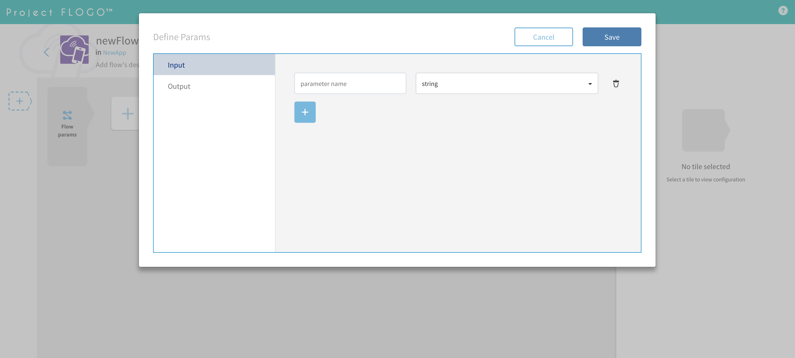
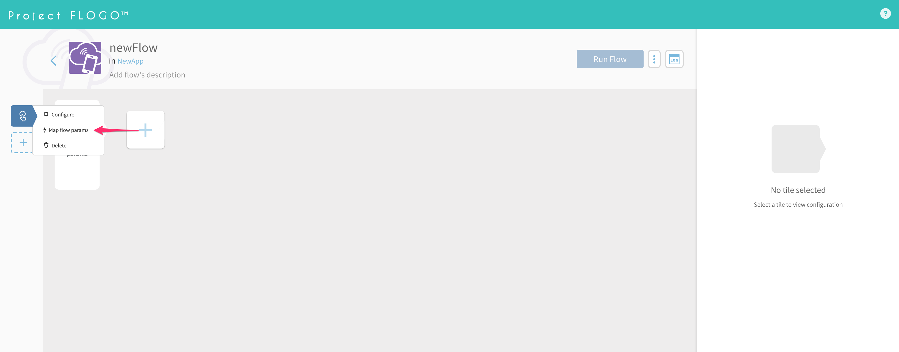
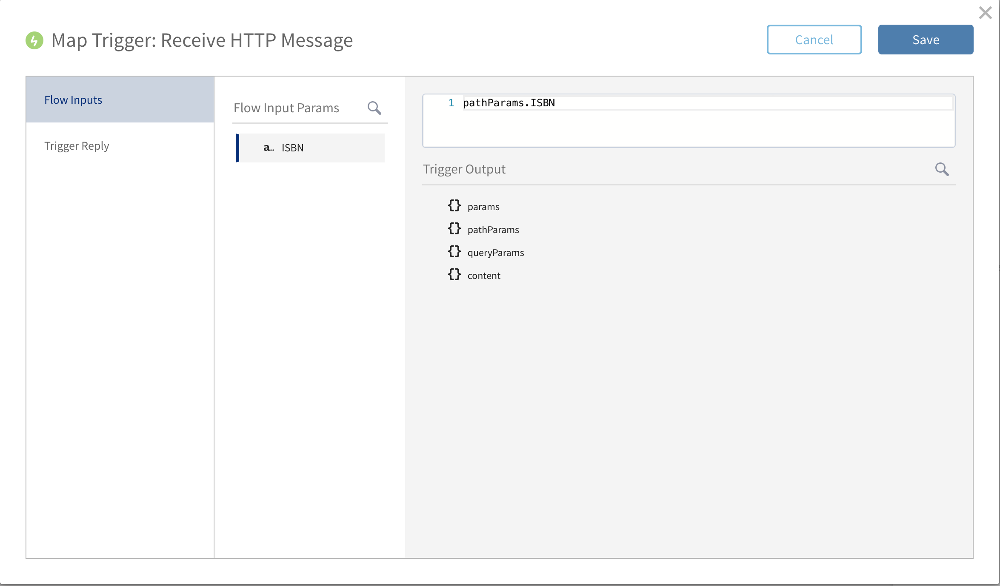

As of Flogo 0.5.0, a Flow is more inline with the concept of a function, that is, a Flow has both input and output parameters. In this section we'll analyze what this means and how to map data between triggers and flows.

## Why?

The concept pf decoupling a trigger from a flow is a key part of supporting multiple triggers and re-use/sharing of a flow. A Flow can now operate against the data that it has defined within its declartion, it otherwords, just like a function, the scope of data that a Flow can operate against must reside within either the Flow context (or as an environment variable).

## Setting Flow Input and Output Params

When building a Flow, you must first define the input and output params, that is, what are the input parameters that a flow can operate against and what parameters will be returned once the Flow has finished executing. To do this, we have options, either use the WebUI or construct the JSON manually.

From the WebUI, open your new Flow, and click the "Flow Params" box, you'll be presented with the Flow input/output editor.



You will be presented with a dialog containing two tabs, Input and Output. Use this dialog to define your input and output parameters.

{}
If you intend to perform complex object mapping choose the type 'object' for either an input or output param. This enables you to construct your own JSON, refer to the Flow Mappings section for details.
{}

If you'd prefer to define the Flows input and output params via the application JSON, you may do so

```json
"actions": [
  {
    "metadata": {
      "input": [
        {
          "name": "ISBN",
          "type": "string"
        }
      ],
      "output": [
        {
          "name": "someResponse",
          "type": "object"
        }
      ]
    }
```

## Mapping Trigger Output and Reply

Because a Flow operates against its own locally scoped data (params), you will need to map the trigger data into the Flow params, as well as the flow params to the triggers reply params(s). This may sound a bit odd at first, however is required to ensure that a trigger is entierly decoupled from a flow, as previously said, enabling flows to be re-used and support multiple paths of invocation via different triggers.

Before we jump in, to understand the concepts used here:

- Trigger output: A trigger is an event-driven construct used to invoke a Flow. A trigger will run logic and perpare data that must be used within a Flow. Think of a REST trigger, the output of the trigger to the Flow will be things like the request data, the HTTP headers, etc.
- Trigger reply: After a Flow has finished executing, it may be desierable to send back data in response to the triggers request. Consider a REST trigger. If the verb was a GET, the reply would be the payload that the trigger must return to the caller.

To map the trigger data using the WebUI, add a trigger to your Flow, and click on it.



Now select "Map flow params".



Now you can map the output of the trigger to Flow input params, and Flow output params can be mapped to the reply params available for the trigger.

If you choose to map directly within the JSON, consider the following triggers definition

```json
  "triggers": [
    {
      "name": "Receive HTTP Message",
      "ref": "github.com/TIBCOSoftware/flogo-contrib/trigger/rest",
      "description": "Simple REST Trigger",
      "settings": {
        "port": "9099"
      },
      "id": "receive_http_message",
      "handlers": [
        {
          "actionMappings": {
            "input": [
              {
                "mapTo": "ISBN",
                "type": 1,
                "value": "pathParams.ISBN"
              }
            ],
            "output": [
              {
                "mapTo": "data",
                "type": 1,
                "value": "someResponse"
              }
            ]
          },
          "settings": {
            "method": "GET",
            "path": "/:ISBN",
            "autoIdReply": "false",
            "useReplyHandler": "false"
          },
          "actionId": "my_flow"
        }
      ]
    }
  ]
```

Note the "actionMappings" within the handler settings.