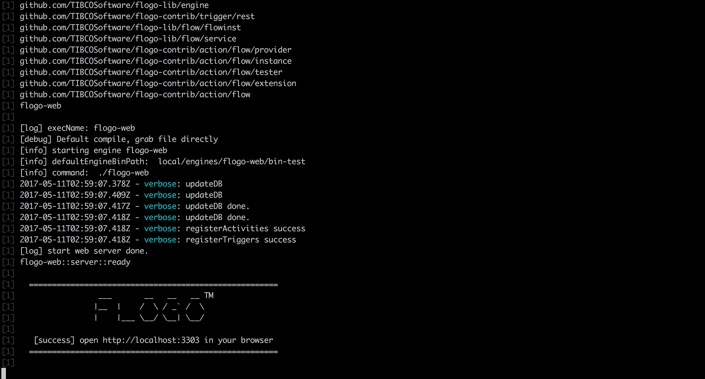
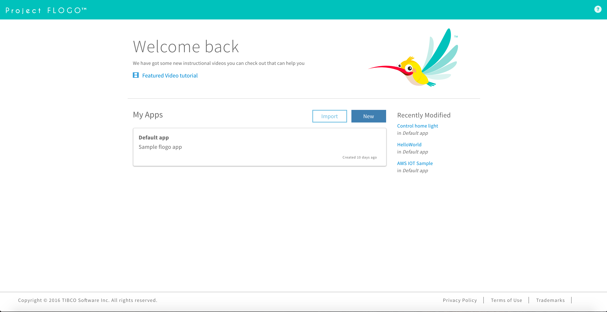

We think it is awesome that you want to get started with Project Flogo! To get started you don't even need to install anything other than Docker!

In this quickstart guide we'll walk you through the prerequisites for getting up and running with your first Flogo app.

### Getting Docker
To make it easy to get started the Flogo Web UI is packaged up as a docker image which you can get from [docker hub](https://hub.docker.com/r/flogo/flogo-docker/). To install Docker for your operating system click [here](https://docs.docker.com/docker-for-mac/install/) for macOS and [here](https://docs.docker.com/docker-for-windows/install/) for Windows. 

{}
If you're planning to run on a Windows machine older than Windows 10, you'll need to install [Docker Toolbox](https://docs.docker.com/toolbox/toolbox_install_windows/)
{}

### Getting the Flogo Web UI
To get started with the latest version of the Flogo Web UI paste this command in a terminal window:

```docker run -it -p 3303:3303 flogo/flogo-docker:latest eula-accept```

The parameters after the `docker run` command are:

* **-it**: This parameter keeps a pseudo-tty terminal open and keeps the terminal running in interactive mode. The Flogo Web Ui will print logs to this terminal window
* **-p 3303:3303**: This parameter tells Docker to bind your computer's port 3303 to the container's port 3303
* **flogo/flogo-docker:latest**: This parameter tells the Docker daemon which container you want to run. In this case it will try to get the latest version of `flogo/flogo-docker`
* **eula-accept**: This parameter says you've accepted the EULA agreement on our [website](http://flogo.io)

After it is done starting the container, you'll see something like the image below in your terminal.



### Launching the Web UI
To launch Flogo WebUI simply open your favorite web browser, and navigate to http://localhost:3303. You'll see our mascot Flynn there to greet you!



### Your first microservice
Let's build a new microservice and add some logic to it. On the welcome page, click on the big blue button that says **New** and choose **Microservice**. At the top of the screen you can give your new microservice a name. Since there are no flows yet, and flows represent the logic of our microservice, let's **Create a flow** next by clicking that button. After naming your flow, simply press **Create**.


Now you can give the new flow, which implements the logic of your service, a new name.


The next step is to make a choice how your flow is triggered. Out of the box Project Flogo comes with a bunch of triggers and if none of them fit your needs, you can either create new ones yourself or look at the community. For now we'll choose the **Receive HTTP Message** as the trigger.


Now we know the flow will be started with an HTTP trigger, and we can configure it. Click on your flow and you'll see the editor for all flows in Project Flogo. Your flow will have a single **activity**, the trigger, which is shown by an orange circle. Click on that to show the configuration panel on the right and edit the value:

* **port**: The HTTP port on which this flow should listen. For this example we'll use `8080`
* **method**: The HTTP method that will trigger the flow. To make testing a bit easier we'll use the `get` method so we can test it from the browser
* **path**: The path for the flow to listen to. We'll set this to `/helloworld` 
* **autoIdReply**: Should the flow automatically reply with the identifier the flow. You can set that to `false`
* **useReplyHandler**: Should the flow send data back. In this case we'll choose `true` to make sure we see something in the browser as the end result

{}
The URL on which our microservice will listen will he http://localhost:8080/helloworld. If you made changes to any of the variables above, please make sure to change those in the rest of these examples.
{}

Add a **Log activity** by clicking on the **+** icon. This will give the flow the ability to write data to the standard output. The message parameter is what you want to write to the log, so for now we'll simply add `Hello World`.  


The last step is to add a reply handler and set the result code to 200. After that is done, click on the **<** to go back to the page where you added your flows. Now we can build an executable out of it to run it on your machine. From that page select **build** and choose the target plaform for which you want to build an executable.

{}
Project Flogo can build binaries for most platforms that exist. If you choose to build one for a unix based system (e.g. Linux or macOS) be sure to add the executable property to it (`chmod +x <executable>`).
{}

Now run the executable you just built (e.g. `./build.dms`) and navigate your browser to http://localhost:8080/helloworld. That should result in something like the below message

