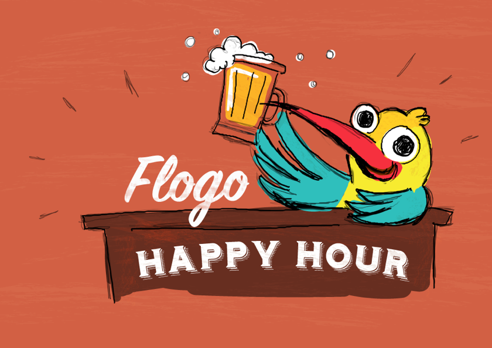

Flogo Happy Hour is a virtual meetup for Flogo enthusiasts & connoisseurs of fine Golang frameworks. We spend an hour talking about tech, use cases and designing software in the open. No BS, no proprietary software talk, it’s all Open Source & Flogo!

The objectives for Flogo Happy Hour are simple, to learn something, contributing something and have fun!

You can find all of the happy hour content and recordings, along with agendas for each session in the corresponding directory matching the date of the happy hour.
